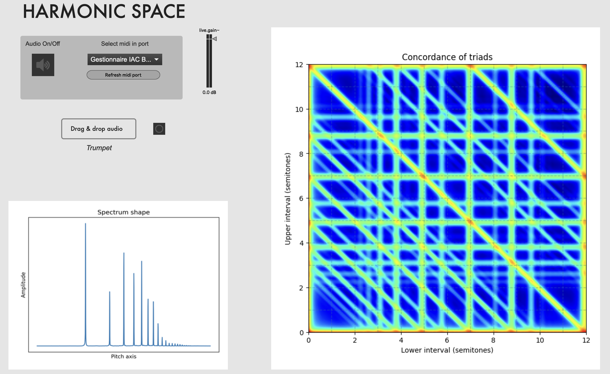

# HarmonicSpaces

## What is it ?
Harmonic spaces is a software that aims to explore the relationship between timbre and harmony. It computes harmonic descriptors on the continuous three-note chords spaces. I developped it after my PhD defense, for the colloquium [1722-2022 : trois siècles du Traité de Jean-Philippe Rameau :  la musique-science devant la question de l'harmonie](https://www.ircam.fr/agenda/1722-2022-trois-siecles-du-traite-de-jean-philippe-rameau/detail).

The principle is as follows. The user imports a basic sample. The harmonic descriptors are then calculated on the chords constructed by transposing this sample. These descriptors are represented using a color code on the three-note chord map. Only one harmonic descriptor has been included so far: concordance, which quantifies the interaction energy between notes. Other descriptors will be added later, including roughness and harmonicity.

For further explanations, please refer to the reading section.



## Requirements

In order to be able to do whatever you want with this project, you need run the following command on your machine:

```bash
# For any operating system
pip3 install -r requirements.txt
```

You need to have Max/Msp installed on your machine. 

Before opening the patch, please open MaxMsp, go to `Options -> File Preferences` and add the path to `HarmonicSpaces/images`, activating the subfolders option. Close Max/Msp in order to validate this step.

## How to use

To open the patch, click on `HarmonicSpaceProject/HarmonicSpaceProject.maxproj`. Before being able to hear anything, you need to load a sound. 

1. Drag and drop a sound. It needs to be monophonic in wav format. Don't use any space in the name. Once the sound is loaded, the analysis can take few seconds. It is done when the spectrum, the map and the sound name appear. Then you can play. 
2. Play on the map. There are two way to make sound, you can either click on the chord you want to hear on the map, and draw trajectories on the map, or plug a midi instrument. If you plug a midi polyphonic instrument, it is recommanded to use a MPE instrulment (Midi Polyphonic Expression), in order to have a continuous pitch control and to be able to access all the chords on the map. Such instruments include the [Osmose](https://www.expressivee.com/) or the [Haken Continuum](https://www.hakenaudio.com/).

## Further reading
- My PhD Thesis: [Les descripteurs harmoniques: étude théorique et applications musicologiques](https://shs.hal.science/tel-03360582/).
- Specific article: [Tenor article](https://d1wqtxts1xzle7.cloudfront.net/118069101/13-TENOR_BOSTON_2023_paper_9279Gaulhiac-libre.pdf?1725870795=&response-content-disposition=inline%3B+filename%3DHarmonic_Maps_Interactive_Visualization.pdf&Expires=1763478962&Signature=P5kLV7NOVUIEa~RrAZ55N59sErpg8dDwRHTgYqd4Xxam~07Hls7Hz~S3hfD8CWCwYP-9CYg4kHhffTrQvvOzAqy1DhqDVNriGmXz4hmsUIwqbkbUyRcLBPLH-W0Crf9PgiGhBWvW1U4XlFYVM3KereNZ1pufHHV~64PR8O-0Hm-qbvWaq7dSTu8ptAGalOQgHRJwM5k5NEHGNosJQijqYd07sHveuJsFIj2R3voW42LdKUxl5lT5q4GTHvUhzp5c8BvCHxH99y1Dbbsk9Vejqt82unHxiFqkDniBeQzUyL4nJheCzsd~ahNWJQfx-sNYJNKceMo9pKlN~guPQG-AFw__&Key-Pair-Id=APKAJLOHF5GGSLRBV4ZA)